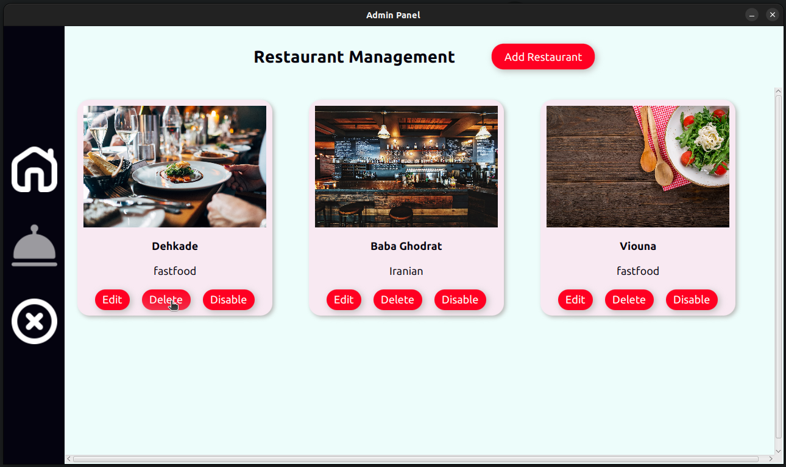
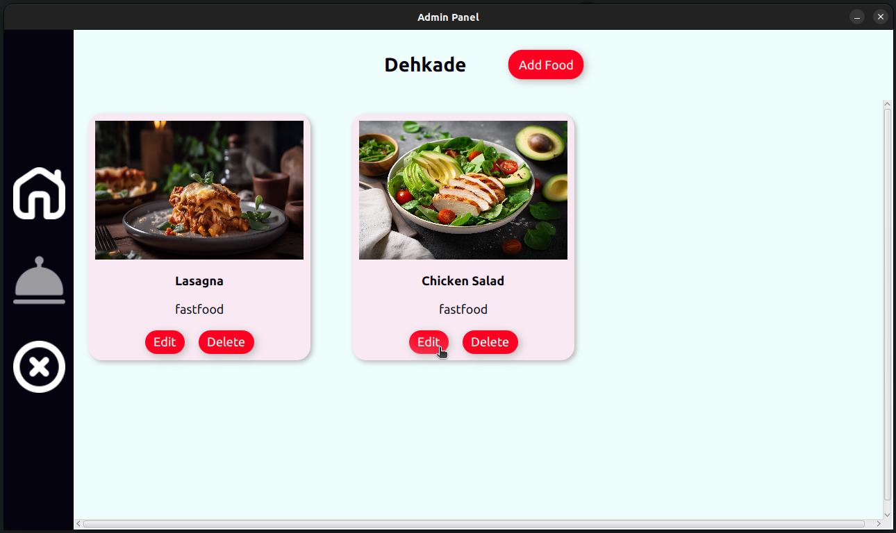
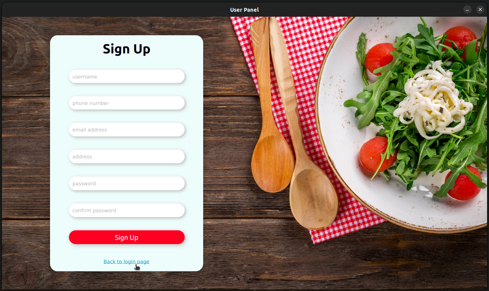
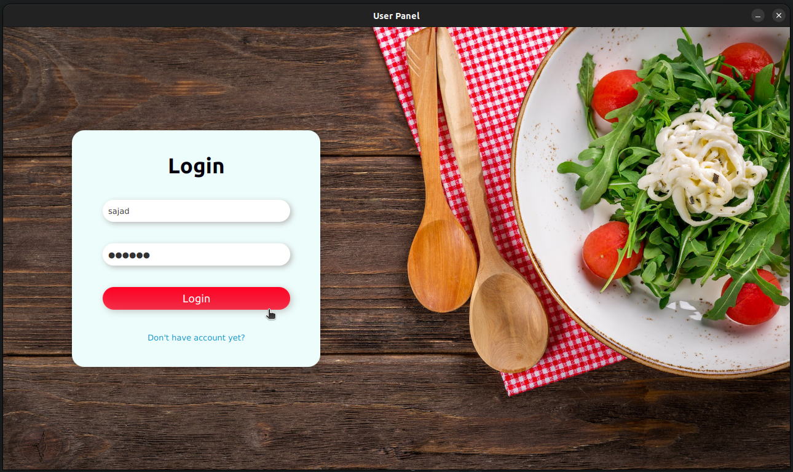
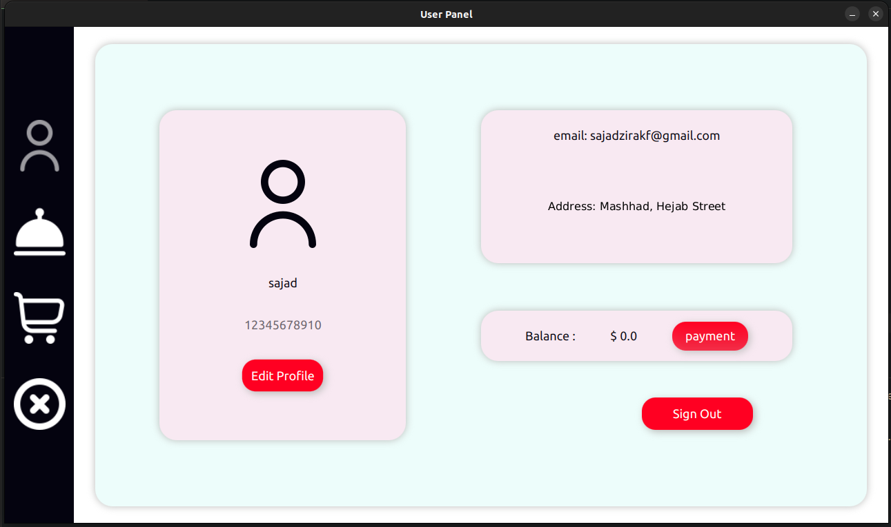
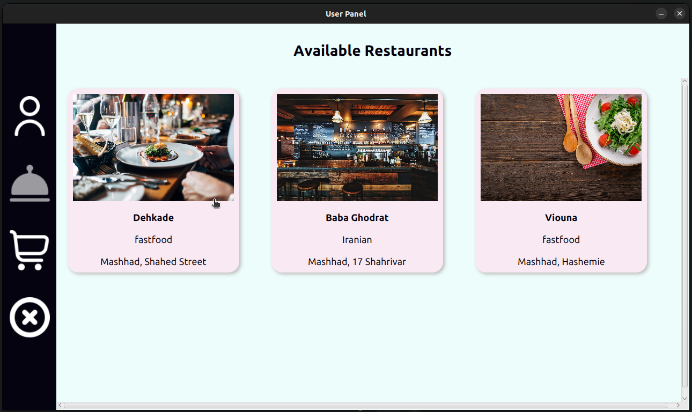
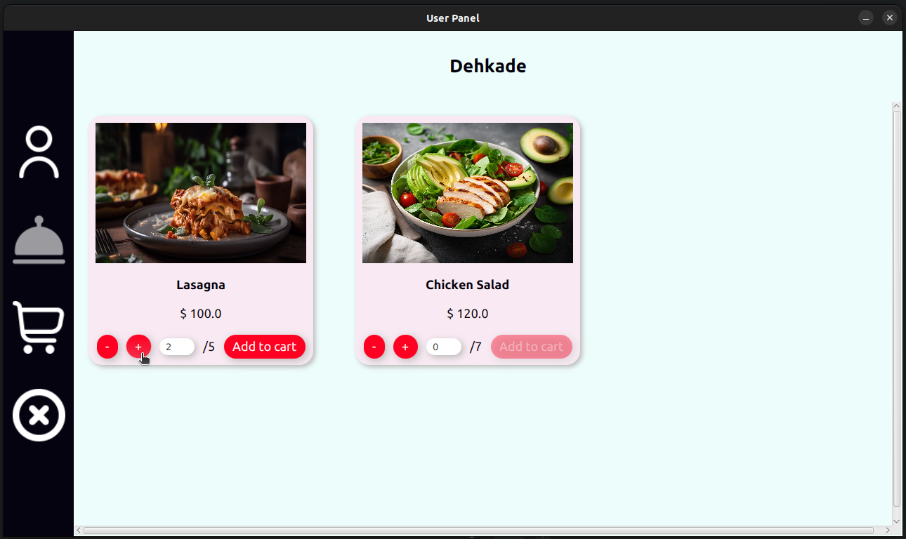
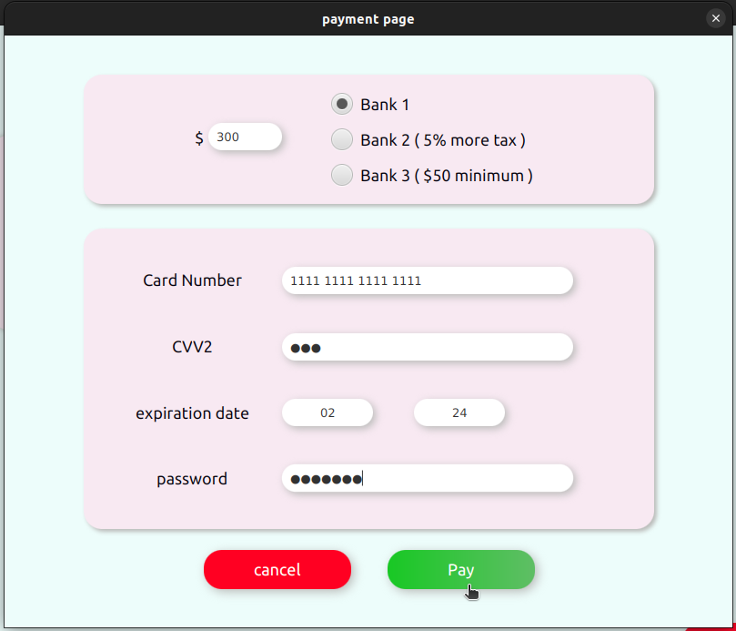
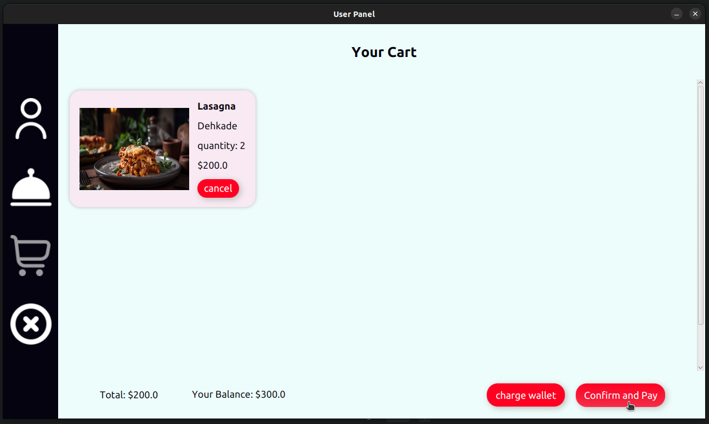

# Food Delivery JavaFX project

this is a simple food delivery project. The project has admin panel and user panel. 
Admin has the permision to add or edit restaurants and foods. Note that admin password is "123" by default and you are able to change it from DataBase.java . 
Users have to sign up first and then they can see the restaurants and foods and order whatever they want.

## How to run it on VSCode

For the first time: 

- Download [JavaFX SDK](https://gluonhq.com/products/javafx/) for your operating 
system and unzip to a desired location.

- Make sure you have the [Extension Pack for Java](https://marketplace.visualstudio.com/items?itemName=vscjava.vscode-java-pack) installed in your Visual Studio Code.

- clone the project open `food-delivery` folder in Visual Studio Code. Open any of the Java files to import the project.

- open `.vscode/settings.json`, replace the `<JavaFX_lib_path>` with your JavaFX lib folder path.

- Open `.vscode/launch.json`, replace the `<JavaFX_lib_path>` with your JavaFX lib folder path.

- Now you have to run `src/main/server/Server.java` first.

- Then you can run `src/main/adminPanel/AdminClient.java` to run admin panel or you can run `src/main/userPanel/UserClient.java` to run user panel.

# screenshots

